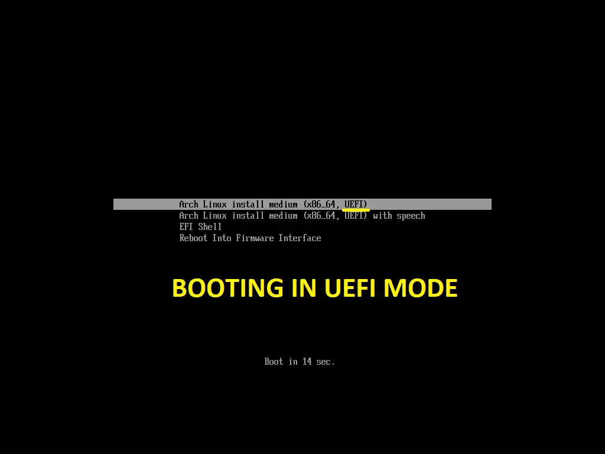
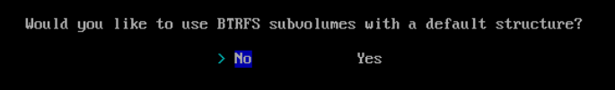

> [!WARNING]  
> If You find this English Translation Inaccurate, create an issue and tell about anything you found

This guide is an updated version of [Vudek](https://osu.ppy.sh/u/8816345)'s osu! low latency guide
# Step 0: Preparation
> [!NOTE]
> This Installation Guide Needs You to Install OS on a Separate Solid State Drive (SSD)
## Step 0.1: Download Arch Linux ISO
To Download Arch Linux ISO, go to the **Official Arch Linux Website** -> https://archlinux.org/download <-

You can use BitTorrent


But if Don't Want to Download Torrent, You can Download From Any Available Mirror in Your Region, to do that, simply scroll down and find your region, for example here's Germany.


Choose Any Available Mirror

Then select `archlinux-{YYYY.MM.01}-x86_64.iso` File


## Step 0.2: Make Bootable Flash Drive (USB)
Instead of making Bootable Flash Drive (USB) through [Rufus](https://rufus.ie/en/), we will make it through [Ventoy](https://www.ventoy.net/en/index.html)

Why, you may ask?

1. **No Binary Dependencies on Download**. You can install from it on UEFI AND Legacy BIOS.
2. **You can have mutliple ISO files on one Flash Drive and Select which OS you want to install**. On one Flash Drive you can have Windows ISO and Arch Linux ISO and other OS' that you need at the same time.
3. **Efficient if your Flash Drive have 32GB+ Storage**. You can create separate Directory for ISO files and use the rest like a regular Flash Drive.

Download Ventoy from Official Source -> https://sourceforge.net/projects/ventoy/files/v1.1.05/

Let's unzip it! then we go to Ventoy's Directory and Run `Ventoy2Disk.exe`:


This Window should appear after you Run the application:


In `Device` Tab select your Flash Drive, then click `Install`

The Programm will Warn you That the Flash Drive will be Formatted and all Files Will be **GONE**.
Make Sure you copy/move/backup files from it:


The Programm will take a simple test ~~on your stupidity~~ on your intentions and you absolutely want to format your Flash Drive, deleting all Files on it:


When you finish Installing Ventoy on your Flash Drive you will be Notified:


In Explorer there will be Two (2) new Devices: `Ventoy` и `VENTOYEFI`

You Need the `Ventoy` one.


Copy your Arch Linux `.iso` File then after successful copying - restart you PC and boot into your newly made Bootable Flash Drive.

~~О том, как зайти в BIOS и загрузится с флешки, надеюсь, вы знаете, объяснять не надо~~
> [!NOTE]
> The Author of this Guide doesn't want to show, how to boot into Flash Drive and thinks y'all can do that yourself 🥀

## Step 0.3: Load into Ventoy UI
When you Load into Ventoy on your Flash Drive, this Window Should Appear:


Here we Select Arch Linux's `.iso` File


Select `Normal mode` Installation, if it Fails - Select `grub2 mode`

After loading into ISO you will meet one of these




**Select First Option** if you're not Blind 
# Step 1: Installation
## 1.1 Preparation
After Loading you should see this:


First off Let's Check our Internet Connection with one simple command - `ping`


if requests are going than means we have internet 👍

`Ctrl`+`C` to exit

If you use Wi-Fi, you should use `iwd` Utility
> [!NOTE]
> Authour's Note: "Sadly i cannot assist you in `iwd` usage guide but if you'd like to help me create Pull Request"

in other case you must use your phone's mobile data and use USB-Tethering (aka USB-Modem/USB-Router) to share your phone's mobile data to the PC
## Step 1.2: Installation
After you connected to the Internet, run `archinstall`


After Loading in you will meet this menu:


### Step 1.2.1: Mirrors
We'll Skip First Two Tabs and start with `Mirrors`

Navigate with arrow keys and `Enter`

After Opening `Mirrors` Tab you'll meet region list:


Select `Mirror region`

In this list select your Country/Region. For ease, press `/` and type your Country in English then hit `Enter`


Should be looking like that (Author's Choice is `Russia`):


### Step 1.2.2: Partitioning
Now going for `Disk configuration`:


Select `Partitioning`


Select `Use a best-effort default partiotion layout`


Author of this Guide was using Virtual Machine so there's only one drive. **Select the drive you need**

Selecting File System:


Select `btrfs` as more efficient File System



Select `No`


Select `Use compression`

Should be like this:


### Step 1.2.3: Disk encryption
We'll skip `Disk encryption` but it's up to you to do it.
### Step 1.2.4: Swap
Make sure that `swap` is enabled:


### Step 1.2.5: Bootloader
`Bootloader` must be Grub.


### Step 1.2.6: Unified kernel images
Leave `Unified kernel images` on Default (Disabled)


### Step 1.2.7: Hostname
You can leave it on Default or write your own. In Terminal it'll look like this:

`username@hostname $`


### Step 1.2.8: Root Password
You can set any (even `1`) but set strong password


Confirm password by repeating it:


### 1.2.9 User
Create user


Select `Add a user`

Set `Username`


Now password:


Confirm password by repeating it:


Give your user superuser permissions:


Now `Confirm and exit`


### Step 1.2.10: Profile (Installing Desktop Environment and Drivers)
Here Select `Type` (Yes this has to be there 😭)


Select `Desktop`


Here we select our Desktop Environment 


You Can Install Multiple DEs like GNOME and KDE Plasma (More like Windows UI) and Tiling Window Manager. You can change DE on log in screen but we'll stick to i3 only - most lightweight DE for any PC but not recommended for beginners (but if you get used to it, thank the Author of this guide :D). If you want to have Multiple DEs, you can select by pressing `Tab` and your Desired DE will be selected like this -> `[x]{Environment}`


Then hit `Enter` and moving on to next Tab:


In `Graphics driver` Tab we Select what Drivers you want to Download for your Dedicated/Integrated Graphics:


If you're using NVIDIA Graphics -> `Nvidia (properietary)` BUT you need to understand that your Graphics must support latest version of NVIDIA Drivers. but if you have GTX 10XX+ then you're save for now. 

If you're using AMD/Intel Graphics then Select corresponding Open-Source Drivers.

`Greeter` Tab. Select your Log in Screen yourself (Author's pick - `sddm`)


### Step 1.2.11: Audio
In `Audio` Tab Select `pipewire`


### Step 1.2.12: Kernel
Here we select the Kernel itself. Instead of Default Kernel we will choose `linux-zen` because this Kernel is Optimized for High Performance. Use `Tab` To Deselect Default Selected `linux` Kernel and Select `linux-zen` and hit `Tab`. Now Press `Enter`


### Step 1.2.13: Network configuration
Select `Use NetworkManager ...` Tab


### Step 1.2.14: Additioncal Packages
We'll Install Additional Packages. You must install `curl`, File Explorer/Manager for example `nemo`, and Web Browser such as `chromium` or `firefox` (or you could search for Web Browser that you're using (if it's open source) and download your Web Browser. Or continue with chromium/firefox to install your Web Browser)


### Step 1.2.15: Optional repositories
Turn `multilib` On. Not-so-must step, because thanks to one script it'll enable this Optional repository.


### Step 1.2.16: Timezone
Setting up our Timezone. Hit `/` and search for your Timezone. In English. (Author's Choice is Asia/Yekaterinburg)


### Step 1.2.17: NTP
Leave `Automatic time sync (NTP)` Tab on by Default


## Step 1.3: Confirm Installation
> [!CAUTION]
> Before proceeding to OS Installation read your configurations like 5 times to ensure that you didn't fuck up this installation. **especially Disk configuration** 
Select `Install` and hit `Enter`. if everything is ok, select `Yes` and hit `Enter`


Installation began, you can make yourself a cup of tea while it installs


> [!TIP]
> While installation is running in the background, follow Author's [Social Media](https://kartavkun.github.io/site/) (🇷🇺)
> 
> i, the English Translator, will not provide my links here as i'm not making lot of content

## 1.4 Post-Installation Configurations

After Installation is Completed You will be prompted will a choice if you want to configure stuff:


Select `No`

But if you have your preferences, Select `Yes` and do your things (What are you even doing here at this point?)

Then we `reboot`:


# 2. Boot into newly Installed OS
## 2.1 GRUB Bootloade
We're now inside of GRUB Bootloader. We only have Arch Linux. Select `Arch Linux`


## Step 2.2: Log in
After the System boots we will face log in screen and user select:


In `Session` Tab in the top-left corner you can select your Desktop Environment, which we will log in to. because we only installed `i3`, we will only have `i3` and `i3 (wuth debug log)`. There's no Performance Difference between them


Now we will input password for our user that we set during installation step:


## Step 2.3: Entering i3
We will see these messages. just press `Enter` two times


## Step 2.4: Setting basic configurations for i3

Open Terminal with `Win`+`Enter` Hotkey (`Super`+`Enter` if you know linux) ⚠FLASHING LIGHTS WARNING⚠


To Install basic configurations for `i3`, enter this line of code:

```bash
curl -fsSL https://raw.githubusercontent.com/kartavkun/i3-dotfiles-minimal/main/install.sh | sh
```

> [!NOTE]
> Here's Repository with configurations - https://github.com/kartavkun/i3-dotfiles-minimal

After you see this message restart `i3` configurations with `Win`+`Shift`+`R` (`Super`+`Shift`+`R`) hotkey


You'll see that the taskbar will be moved to the top of the screen and it'll look cleaner 


## Step 2.5: Tuning

You may close this white and disgusting terminal with `Win`+`Q` (`Super`+`Q`) (this hotkey used to close currently active windows (focused)). now open new terminal by pressing `Win`+`Enter` (`Super`+`Enter`)


Now to open our `i3` configuration file we have to type:
```bash
nano .config/i3/config
```
`nano` is a text file editor that we will use right now and tune our `i3` config with it


Navigate with arrow keys.

### Step 2.5.1: Installing Language packs and layout

By Default there's only English. To add one more Language you need to move your cursor to line `set $layouts us` and add Comma (`,`) and add desires language (i.e `set $layouts us,ua,ru,es`)


By Default to change keyboard layout you need to press `Win`+`Space` (`Super`+`Space`) (like on Windows) but if you want to change to desired hotkey (i.e `Alt`+`Shift`) you need to find line `grp:win_space_toggle` and change `win_space_toggle` to `alt_shift_toggle`


Save configuration file with hotkey `Ctrl`+`O` `Enter`

Then Reload configurations with `Win`+`Shift`+`R` (`Super`+`Shift`+`R`)

To exit `nano` hit `Ctrl`+`X`

### Notes
> [!NOTE]
> Basically here's is individual setting for anyone so if you want you can tune it lie you want. you can use Google/ChatGPT if you want to sugarcoat your *minimal osu setup*

### Step 2.5.2: Fix tray
By Default Tray is Disabled, because universal configurations are non existent and if you have multiple monitors then it's pain in the rear end. so we will fix that right now:

First off you need to know what Output you Display has. Type `xrandr` and hit `Enter`:


To showcase it ~~i~~ Author tested `xrandr` on non Virtual Machine and as you can see Author has multiple Displays. Here you can also see all available Resolutions and Hz for them. in Author's case it's `HDMI-A-0`.

now you go back to your configuration file and find line `# set $tray {your preferred output}` you need to uncomment this like (remove `#` at the start of the line) and change `{your preferred output}` to your Displays' mark. in Author's case it's `HDMI-A-0`


Save and Reload configuration. `Win`+`Shift`+`R` (`Super`+`Shift`+`R`) then tray should appear in top-right corner.


### Step 2.5.3: Display order settings
> [!NOTE]
> If you only have one Display and Default settings work fine for you, you can skip this step
> Also if you use NVIDIA Graphics you need to install `nvidia-settings` (`sudo pacman -S nvidia-settings`) now open Terminal as superuser (`sudo` i.e `sudo nvidia-settings`). You can find how to set up NVIDIA settings yourself because Author uses AMD. :P

Once again `xrandr`.

Author has 3 Displays One of which is to the left of Primary Display and in Portrait Mode and Second is below Primary One

To set it like i need i will enter these lines:
`xrandr --output {Display1} --right-of {Display1} --rotate {left/right(try one of these to find the right rotation for your Display)}`
`xrandr --output {Display2} --below {Display0}`

As an addition here's line to make a Display Primary:
`xrandr --output {Display} --primary --rate {Refresh rate (Hz)}(In Case the Refresh rate in set incorrectly you can see active refresh rate from list Displayed with Asterisk (*))`

Here's list of flags so you don't get confused:


Now we'll enter those commands to configuration file. Open Configration file and enter needed lines:


Here we'll uncomment line `exec_always --no-startup-id xrandr {settings}` and change `{settings}` to your configurations. if you have multiple, then add new lines that will look like  this `exec_always --no-startup-id xrandr {settings}`.

In my case it look like this:


Save and Reload Configuration File. `Win`+`Shift`+`R` (`Super`+`Shift`+`R`)

### Step 2.5.4: Setting up Wallpaper
If you want something instead of black screen. you can install `feh`
```bash
sudo pacman -S feh
```

Then download preferred wallpapers in your directory and don't delete them right away. for example i will use these wallpapers:


Use `nemo` File Explorer, that we installed earlier. You can create separate directory to not accidentally delete it from downloads:


Now we'll Copy our Wallpapers

Go to configuration file and fine line `#exec_always --no-startup-id feh --bg-scale ...` uncomment and delete `{set path to your background image}` and paste Path to your Wallpapers (TO PASTE YOU HAVE TO PRESS `Ctrl`+`Shift`+`V`, not regular `Ctrl`+`V`!!!)

Should look like this:


Save and Reload Configuration File `Win`+`Shift`+`R` (`Super`+`Shift`+`R`)

As you can see everything works well


## Step 2.6: Hotkeys
Crib note for `i3` beginners:

> `Win`+`Enter` - Open Terminal
> 
> `Win`+`R` - Open App Launcher
> 
> `Win`+`Q`- Close Currently Focused Window


> `Win`+`LMB` - Change the Position of an Active Window
> 
> `Win`+`RMB` - Change the Size of an Active Window
> 
> `Win`+`Shift`+`Space` - Switch between Windowed and Fullscreen on an Active Window
>
> `Win`+`1`, `2`, `3`, ..., `0` - Switch between Desktop `1`, `2`, `3`, ..., `0`
> 
> `Win`+`Shift`+`1`, `2`, `3`, ..., `0` - Move your Active Window to Desktop `1`, `2`, `3`, ..., `0`
>
> `Ctrl`+`Win`+`Right` - Switch to Next Desktop
> 
> `Ctrl`+`Win`+`Left` - Switch to Previous Desktop


> `Win`+`Shift`+`R` (`Super`+`Shift`+`R`) - Reload `i3` Configuration (if you're editing Configuration File)

# Step 3: Downloading and Installing osu!stable
You can open your Web Browser and copy link to run script which will install osu! with Drivers and Other Dependencies. Paste following command in Terminal:
```bash
curl -fsSL https://raw.githubusercontent.com/kartavkun/arch-osu-wine/main/setup.sh | sh
```
Installing will be fully done automatically. if you get promted to enter your Password, wait for Installation to Finish until you'll see this message:


With the game there will be Installed `OpenTabletDriver`, Sound Setting with lowest Delay, `Wootility` compatibility files, `Drunkdeer-Antler` and `SayoDevice`'s Web Drivers. ⚠CAN ONLY CONFIGURE ON `Chromium` BASED WEB BROSER⚠ -> [list of browsers from wiki](https://en.wikipedia.org/wiki/Chromium_(web_browser)#Browsers_based_on_Chromium)

> [!NOTE]
> If you have other Device with Rapid Trigger settings in Web Browser - create an [Issues](https://github.com/kartavkun/arch-osu-wine/issues) i will assist you and add it to Repository

All done!

# Step 4: Launching osu!stable
To Launch osu!, Run a command in your Terming for correct first start-up:
```
.local/bin/osu
```
After the game has Launched, you may exit and from now on Run osu! through App Launcher.

## Step 4.1: Fixes
> [!NOTE]
> If you have no Audio or it Stutters - Find your Solution [Here](https://github.com/kartavkun/arch-osu-wine?tab=readme-ov-file#troubleshooting).
> 
> If OpenTabletDriver doesn't work, Simply `reboot`, should be working fine (Button on the top-right corner).
> 
> If you have Black Screen time to time, turn on compatibility mode.
> 
> On Web Browsers (excluding `firefox` and it's forks, i only know `Librewolf`) there's and issue where you cannot always open Beatmap/Skin Files, just opened them through File Explorer.
>
> There's no more issues that are known that are too critical, but if you find them - create an [Issues](https://github.com/kartavkun/arch-osu-wine/issues) 

# Step 5: Additions
## Step 5.1: Discord
if you want to use Discord to Screen Share with Sound -> ~~Use [Vesktop](https://github.com/Vencord/Vesktop)~~ Just Download Discord 
```bash
sudo pacman -S discord
```
## Step 5.2: osu! trainer
If you need osu! trainer to create practice difficulties with custom rate changes, AR, OD, CS and HP - Type this in your Terminal:
```
echo "[home_hwsnemo_packaged-wine-osu_Arch]
Server = https://download.opensuse.org/repositories/home:/hwsnemo:/packaged-wine-osu/Arch/\$arch" | sudo tee -a /etc/pacman.conf

key=$(curl -fsSL https://download.opensuse.org/repositories/home:hwsnemo:packaged-wine-osu/Arch/$(uname -m)/home_hwsnemo_packaged-wine-osu_Arch.key)
fingerprint=$(gpg --quiet --with-colons --import-options show-only --import --fingerprint <<< "${key}" | awk -F: '$1 == "fpr" { print $10 }')
sudo pacman-key --init
sudo pacman-key --add - <<< "${key}"
sudo pacman-key --lsign-key "${fingerprint}"

sudo pacman -Sy --needed home_hwsnemo_packaged-wine-osu_Arch/cosu-trainer
```

Also you need to uncomment line in `i3` Configuration File `# exec --no-startup-id osumem` (remove `#` at the beginning) because if you don't - osu! trainer will not work, it just won't be able to read osu!'s memory, read Now Playing Beatmap and Difficulty that you want to Practice.
## Step 5.3: osu!lazer
```bash
yay -S osu-lazer-bin
```

## Step 5.4: gamemode
This program increases performance in games 😄

To Install gamemode run this in your Terminal:
```
sudo pacman -S gamemode
```
Then copy and paste this sheet in your Terminal:
```
mkdir -p ~/.config/gamemode
echo "[general]
renice=19

disable_splitlock=1

desiredgov=performance

[gpu]
nv_powermizer_mode=1

amd_performance_level=high" | tee -a ~/.config/gamemode/gamemode.ini
```
Then open file for Launching game for example with `nano`:
```
nano ~/.local/bin/osu
```
Here you will find this line:
```
LAUNCH_ARGS=""
```
Here we'll add `gamemoderun`:
```
LAUNCH_ARGS="gamemoderun"
```
