Данный гайд является обновлённым гайдом от [Vudek'a](https://osu.ppy.sh/u/Vudek)
# 0 этап: Подготовка
## Рассматривается вариант установка отдельный диск (SSD)

(Напишите подготовку сами, мне впадлу, да и винды давно нет)

После загрузки на флешку у вас будет один из вариантов экрана:

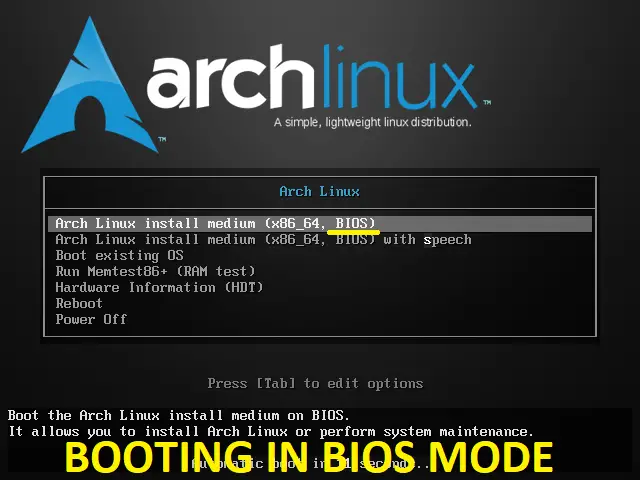
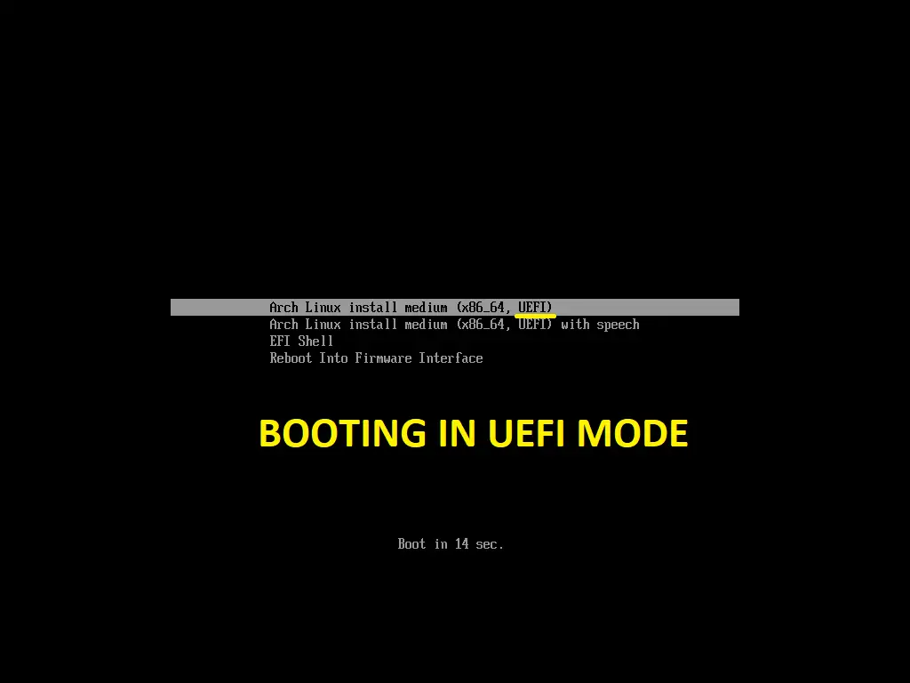

Выбирайте первый пункт
# 1 этап: Установка
## 1.1 Подготовка
После загрузки у вас должно быть следующим образом:

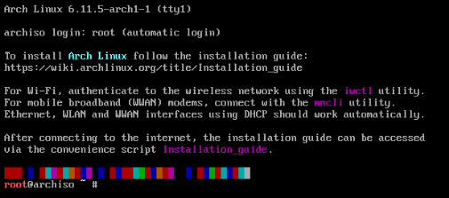

Сначала проверим интернет соединение командой `ping`

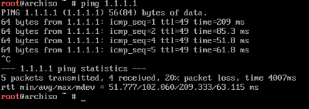
Если запросы идут, значит интернет есть.

Чтоб закончить нажмите Ctrl+C

Если вы используйте Wi-Fi, то надо воспользоваться утилитой `iwd`

К сожалению, я не могу продемонстрировать это в данном руководстве, но если вы сможете помочь мне, пожалуйста, сделайте PR

В противном случае, подключите телефон через провод к вашему компьютеру и раздайте интернет через него
## 1.2 Установка
После того, как мы убедились в подключении к сети, запускаем `archinstall`


После загрузки у вас будет такое меню:

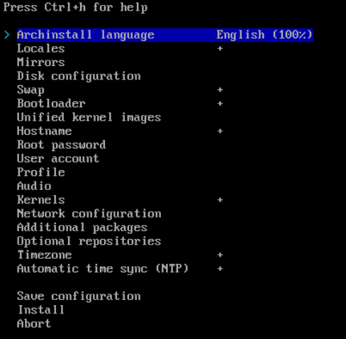
### 1.2.1 Зеркала
Пропускаем первые два пункта, начинаем с `Mirrors`

Управление производится стрелками и Enter

После открытия меню `Mirrors` будет следующее:

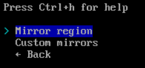

Выбираем `Mirror region`

В меню выбирайте свою страну. Чтоб легче найти свою страну, нажмите `/` и пишите свою страну на английском, потом нажимаете `Enter`

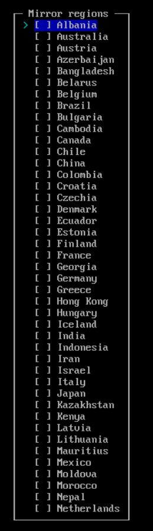

Должно быть так (В моём случае `Russia`):

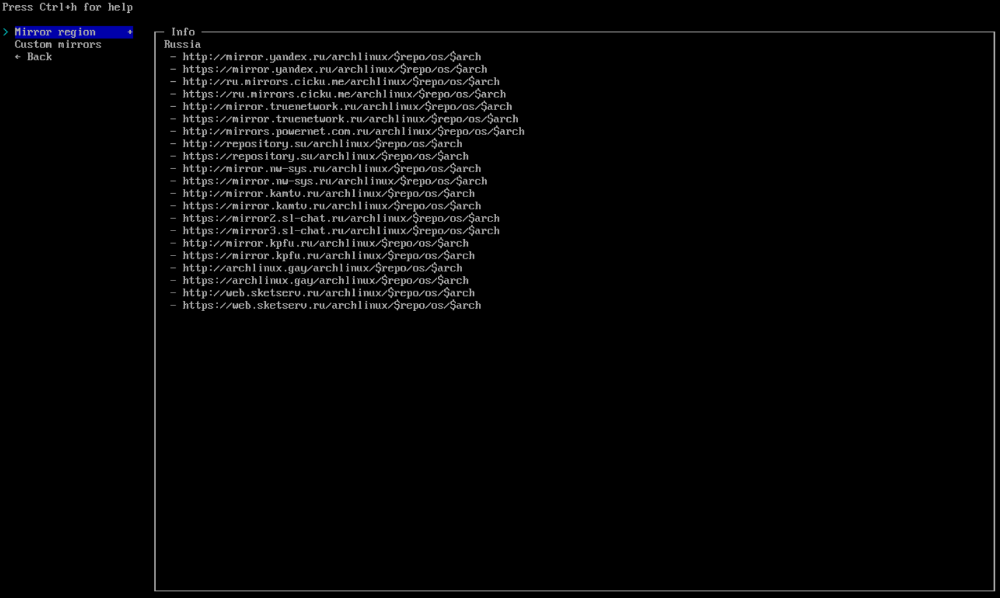
### 1.2.2 Разметка дисков
Затем `Disk configuration`:

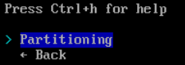

Выбираем `Partitioning`

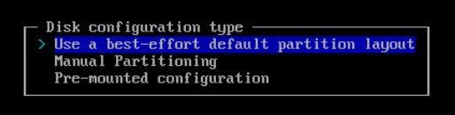

Выбираем `Use a best-effort default partiotion layout`

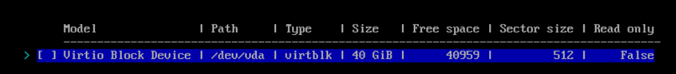

Так как я на виртуалке, тут один диск, а вы должны выбрать свой нужный

Выбираем файловую систему:

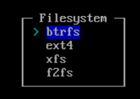

Выбираем `btrfs` как более быструю файловую систему

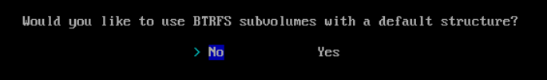

Выбираем `No`

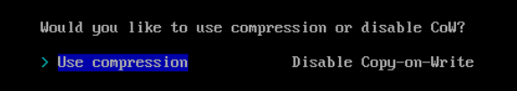

Выбираем `Use compression`

Должно быть вот так:

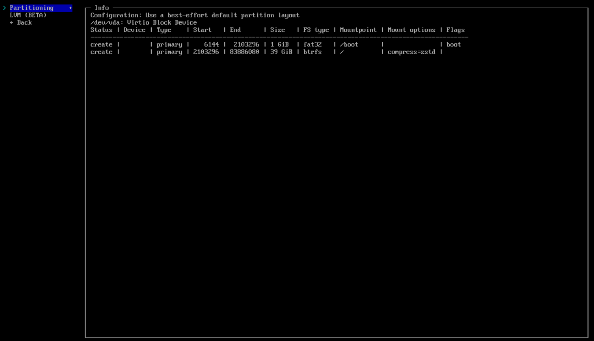
### 1.2.3 Шифрование диска
Пропускаем пункт `Disk encryption`, но можете сделать.
### 1.2.4 Файл подкачки
Убедимся, что `swap` включён:
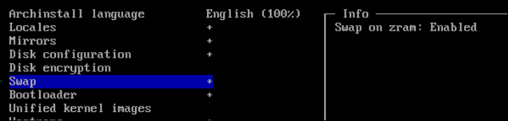
### 1.2.5 Загрузчик
`Bootloader` выбираем Grub
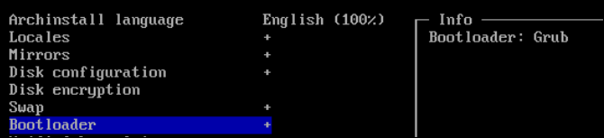
### 1.2.6 Унифицированные образы ядра
Оставляем `Unified kernel images` по дефолту (Disabled)
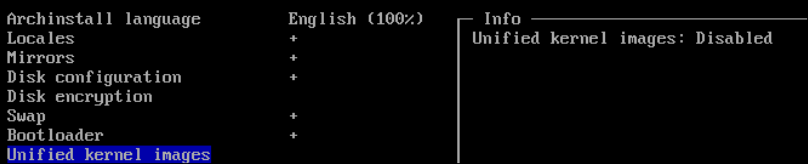
### 1.2.7 Хостнейм
Можете оставить по дефолту, либо написать свой. В терминале будет вот так: 

`username@hostname $`
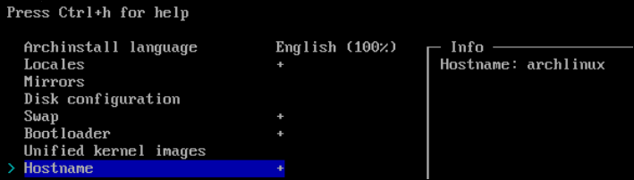
### 1.2.8 Пароль рута
Ставьте любой, хоть `1`, но лучше надёжнее


Подтверждаем пароль, вводя его снова:


### 1.2.9 Пользователь
Создаём пользователя


Нажимаем `Add a user`

Вводим `Username`


Дальше пароль:


Подтверждаем пароль, вводя его снова:


Даём права супер-пользователя:


Затем `Confirm and exit`


### 1.2.10 Профиль (Установка рабочего окружения и драйверов)
Здесь выбираем `Type` (Почему этот промежуточный этап не уберут?)


Затем выбираем `Desktop`


Здесь мы выбираем рабочее окружение. 


Их можно установить несколько, как и привычные GNOME или KDE Plasma (Более схожий с Windows интерфейс), так и тайловые оконные менеджеры. Между окружениями можно переключаться в окне ввода пароля. Мы же будем использовать i3-wm, как легкое окружение для ресурсов ПК, хоть и немного не привычное для новичков (Но если привыкните, потом спасибо скажите :D ). Если хотите выбрать несколько, то выделите окружение и нажмите `Tab`, и окружение выделиться как `[x]{окружение}`


Затем нажимаем `Enter` и переходим в следующее меню:


В меню `Graphics driver` мы выбираем какие драйвера будем устанавливать для нашей видеокарты:


Если вы используете карту от Nvidia то выбирайте `Nvidia (proprietary)`, но стоит учитывать, что последняя версия драйвера поддерживает вашу видеокарту. Если у вас минимум GTX 1000 серии, то ПОКА можете жить спокойно, а вообще `♫ Лучше купи Vega'у, 56-ую Vega'у ♫ :D`

Если у вас карта AMD или Intel, то выбирайте соответствующий опен-сурс драйвер.

Пункт `Greeter` выбираем окно авторизации. Советую `sddm`


### 1.2.11 Аудио сервер
В разделе `Audio` выбираем `pipewire`


### 1.2.12 Ядро
Здесь мы выбираем само ядро. Вместо дефолтного ядра будем использовать `linux-zen` как ядро с оптимизациями для повышению производительность. Через `Tab` убираем выделение с дефолтного ядра `linux` и через `Tab` выделяем `linux-zen`, затем нажимаем `Enter`


### 1.2.13 Настройки интернета
Выбираем пункт `Use NetworkManager ...`


### 1.2.14 Дополнительные пакеты
Мы установим дополнительные пакеты. Обязательно установите `curl`, файловый менеджер, например `nemo` и браузер, например `chromium` или `firefox`


### 1.2.15 Дополнительные репозитории
Включаем `multilib`. Не совсем обязательный этап, ибо благодаря одному скрипту как раз включит данный дополнительный репозиторий


### 1.2.16 Часовой пояс
Устанавливаем часовой пояс. Нажав `/` можно легче найти нужный часовой пояс. Пишите на английском (В моём случае Санкт-Петербург)


### 1.2.17 NTP
Пункт `Automatic time sync (NTP)` оставьте по дефолту включенным


## 1.3 Подтверждение установки
> [!CAUTION]
> Перед тем как начать устанавливать систему, убедитесь, что вы всё верно указали. В особенности конфигурацию дисков.

Выбираем пункт `Install` и если всё хорошо, то нажимайте `Yes`


Начинается установка и осталось только ждать.


Пока идёт установка, можете поддержать меня подпиской на мои [соц. сети](https://kartavkun.github.io/site/) . 

## 1.4 Дополнительные настройки
После установки у вас появится данное сообщение:


Выбираем `No`

Но если вы знаете, что делать, то можете нажать `Yes` и сделать свои дела (Вопрос, зачем вы читаете этот гайд тогда?)

После мы перезагружаемся:


# 2. Загрузка в установленную ОС
## 2.1 Загрузчик Grub
Мы в загрузчике GRUB. Пока у нас только наш Арч. Выбираем `Arch Linux`


## 2.2 Вход
После загрузки системы мы попадаем в окно ввода пароля и выбор пользователя:


В меню `Session` в левом верхнем углу можно выбрать рабочее окружение, в которое мы войдём. Так как мы устанавливали только `i3-wm`, у нас только `i3` и `i3 (with debug log)`. Разницы на работоспособность между ними нет.


Теперь вводим пароль от пользователя, который мы устанавливали при установке и созданию пользователя:


## 2.3 Вход в i3-wm
Мы увидем данные сообщение, где мы просто нажимаем два раза `Enter`


## 2.4 Установка стартовых настроек для i3

Нам надо запустить c помощью комбинации клавиш `Win+Enter`. ОСТОРОЖНО, ФЛЕШБЕНГ


Для установки стартовых настроек для i3-wm введите следующую команду:

```bash
curl -fsSL https://shorturl.at/MRENP | sh
```

> [NOTE]
> Не переживайте, я сократил ссылку, чтоб не пришлось долго и скрупулёзно писать долгую ссылку для запуска скрипта из Github.
> Вот репозиторий с настройками - https://github.com/kartavkun/i3-dotfiles-minimal

После того, как вы увидите данное сообщение, перезагрузите конфиг i3 комбинацией клавиш `Win+Shift+R`


Вы увидите, что бар из низа перейдёт вверх, а также он будет куда чище:


## 2.5 Донастройка

Вы можете закрыть этот белый, ужасный терминал комбинацией клавиш `Win+Q`(Комбинация клавиш для закрытия активного окна, т.е. на который вы сфокусированы), и открыть новый терминал:


Теперь нам надо открыть конфигурационный файл i3. Для этого введите команду:
```bash
nano .config/i3/config
```

Откроется текстовый редактор `nano`, через который мы будем донастраивать i3 под ваши предпочтения


Управление осуществляется стрелками.

### 2.5.1 Установка языка и смены языка
По умолчанию стоит только английский язык. Чтоб добавить русский, вам нужно переместиться на строку: `set $layouts us` и дописать запятую, и слитно написать `ru`


По умолчанию для смены языка используется сочетание клавиш `Win+Space` (как и на Windows), но если вы хотите сменить на нужную вам комбинацию, например `Alt+Shift`, то вас нужно обратиться к строке `set $changelang_toggle` и поменять `win_space_toggle` на `alt_shift_toggle`


Сохраняем файл конфигурации нажатием клавиш `Ctrl+O`, `Enter`

Затем перезагружаем конфиг комбинацией клавиш `Win+Shift+R`

Для выхода из `nano` нажмите `Ctrl+X`

### 2.5.? Допишу позже...

## 2.6 Горячие клавиши
Шпаргалка для новичков i3-wm:
``
Win+Enter - Запуск терминала
Win+R - Запуск лаунчера приложений
Win+Q - Закрыть активное окно

Win+ЛКМ - Изменение положения активного окна
Win+ПКМ - Изменение размеров активного окна
Win+Shift+Space - Сделать активное окно в виде "окна" и обратно

Win+1, 2, 3 ... 0 - Переход на рабочий стол 1, 2, 3 ... 10
Win+Shift+1, 2, 3 ... 0 - Перенос активного окна на рабочий стол 1, 2, 3 ... 10

Ctrl+Win+Right - Переход на следующий рабочий стол
Ctrl+Win+Left - Переход на предыдущий рабочий стол

Win+Shift+R - Перезагрузка конфига (для изменений в конфигурационном файле)
``