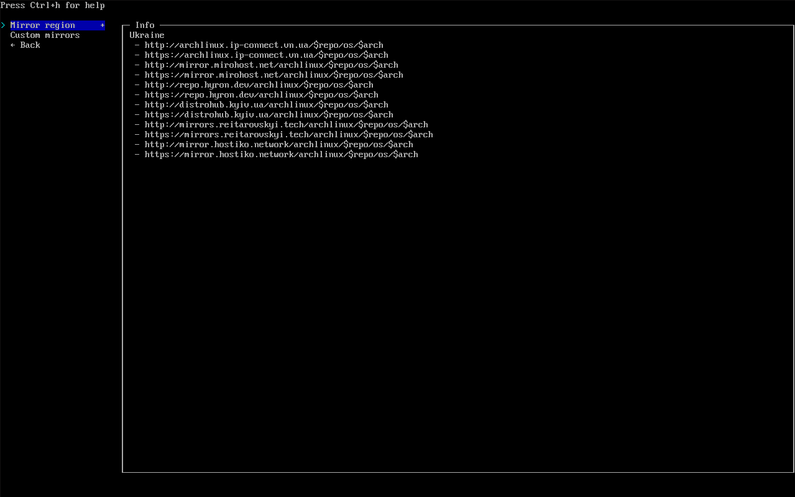
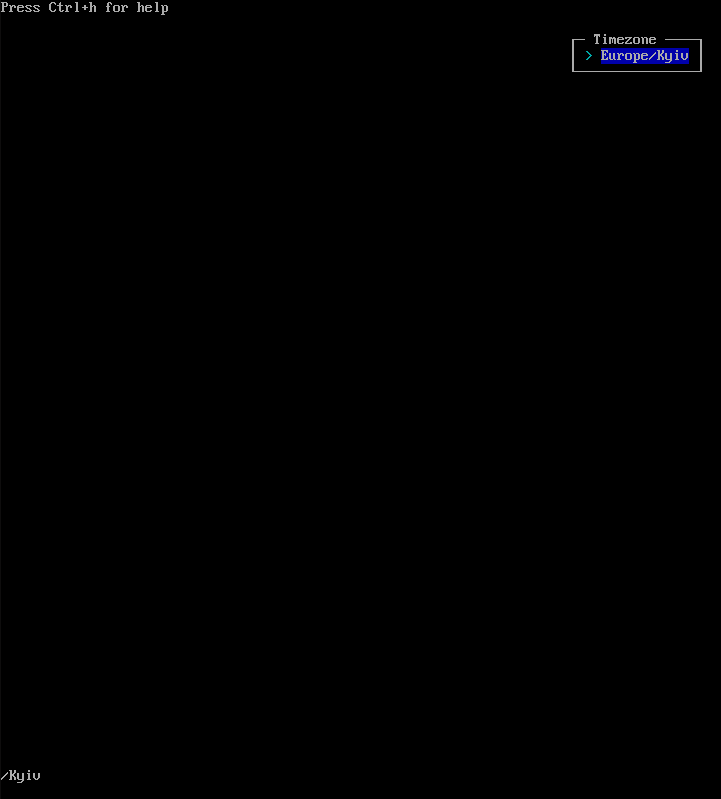

Цей гайд є оновлення від гайда [Vudek'a](https://osu.ppy.sh/u/Vudek)
# 0 етап: Підготовка
> [!NOTE]
> Робиться встановлення на окремому накопичувачі (SSD)
## 0.1 Завантаження образу Arch Linux
Завантажити Arch Linux можна через **офіційну веб-сторінку Arch Linux** -> https://archlinux.org/download <-

Завантажити можна через BitTorrent


Також доступно завантаження через дзеркала в різних країнах, для цього знайти відповідну країну, наприклад Німеччина


Обирайте відповідну країну

Та натисніть на, `archlinux-{рік.місяць.01}-x86_64.iso`


## 0.2 Створення завантажувальну флешку
Замість використання [Rufus](https://rufus.ie/en/), ми робимо завантажувальну флешку через [Ventoy](https://www.ventoy.net/en/index.html) 

*Навіщо?*

1. **Нема залежності від завантаження**. Дозволяється встанолювати на UEFI та Legacy BIOS.
2. **На флешку можна мати декілька образів та обирати з якого образу встановлювати**. На флешці може бути як образ Arch Linux, так наприклад образ Windows 11. 
3. **Краще, якщо флешка більш ніж 32GB** Так ви матиме можливість створити каталог(том) з образами та решту пам'яті як звичайну флешку

Встановлюємо Ventoy з офіційного ресурсу- https://sourceforge.net/projects/ventoy/files/v1.1.05/ventoy-1.1.05-windows.zip/download

Розпаковуємо, знаходимо та запускаємо `Ventoy2Disk.exe`:


Після з'явиться вікно:


В `Device` обираємо вашу флешку, після натискаємо  `Install`

Додаток попередить вас, що флешка буде сформована та всі файли **СТЕРТІ**. Тому заздалегідь збережіть всі файли на вашій флешці 


Додаток проведе невеличкий тест ~~на дуреня~~ на намір, остаточно бажаєте сформатувати флешку та видалить все на флешці:


Коли встановлення закінчиться, вас повідомлять :


В Провіднику буде два нових пристроя: `Ventoy` и `VENTOYEFI`

Нам буде потрібно `Ventoy`.


Переміщаємо завантажений `.iso` файл в папку, після цього перезапускаємо ваш комп'ютер та запускаємось через вашу флешку

Я сподіваюсь, що знаєте як зайти в BIOS

>[!NOTE]
>Автор ледаща хвойда, тому клацайте швидко F12

## 0.3 Запуск у інтерфейс Ventoy
Коли ви увійдете у Ventoy з флешки, то з'явиться вікно:


Потрібно обрати `archlinux-{рік.місяць.01}-x86_64.iso`


Обираємо `Boot in normal mode`. Якщо не спрацює, то спробуйте `Boot in grub2 mode`

Після обираємо, як вказано нижче


Обираємо перший ряд
# 1 етап: Встановлення
## 1.1 Перевірка Інтернета
Вітаю в Arch Linux! Після завантаження ви отримаєте це:


По перше перевіремо підключення до Інтернету за допомогою команди `ping 8.8.8.8`


Якщо запити проходять, у вас є інтернет 😙.

Завершити команду Ctrl+C

Якщо використовуєте Wi-Fi, вам потрібно утіліта `iwd`
>[!NOTE]
>Примітка автора: "Нажаль не можу продемонструвати `iwd`, але якщо є можете допомогти мені, створіть Pull Request"

Інакше, вам потрібно підключити телефон через usb-дріт до компьютера та ввімкнути роздачу мобільного інтернета
## 1.2 Встановлення
 Коли отримали Інтернет, вводимо `archinstall`


Після загрузки, побачите меню:


### 1.2.1 Дзеркала
Пропускаємо перші два рядка та запускаємо `Mirrors`

Переміщення між рядками робиться за допомогою стрілок та обрати клавішою `Enter`

Після відкриття `Mirrors` буде відкрито наступне:


Обираємо `Mirror region`

В меню обираємо країну, для зручності, натискаємо `/` та вводимо назву країни англійською та клацаємо `Enter`


Повинно бути так (В моєму випадку `Ukraine`):



### 1.2.2 Розмітка диску
Наступне шукаємо `Disk configuration`:


Обираємо `Partitioning`


Обираємо `Use a best-effort default partiotion layout`


Так як автор використовує віртуальну машину, то в нього тільки один диск. Обираємо потрібно вам диск

Обираємо файлову систему:


Обираємо `btrfs` як більш швидку файлову систему


Обираємо `No`


Обираємо `Use compression`

Повинно виглядати так:


### 1.2.3 Шифрування диску
Пропускаємо `Disk encryption`, але можете зробити.
### 1.2.4 Файл підкачки
Переконаємося, що `swap` ввімкнено:


### 1.2.5 Завантажувач
У `Bootloader` обираємо Grub


### 1.2.6 Уніфіцірованна образ ядра
Залишаємо`Unified kernel images` як є (Disabled)


### 1.2.7 Хостнейм
Можете залишити або змінити на своє. В терміналі це буде виглядати так: 

`username@hostname $`


### 1.2.8 Пароль рута(адміну)
Придумайте надійний пароль для рута.


Підтверджуємо його:


### 1.2.9 Користувач
Далі `User account`


Натискаємо `Add a user`

Вводимо `Username`


Далі пароль:


Подтверджуємо пароль:


Даємо право супер-користувача:


Потім `Confirm and exit`


### 1.2.10 Профіль (Встановлення робоче середовище та драйвери)
Тут беремо `Type` (Хто арч як сервер ставить?) )


Тут обираємо `Desktop`


Тут ми обираємо робоче середовище 


Тут можна встановити декілька робочих оточень, як от GNOME або KDE Plasma (Більш схожий на Windows інтерфейс), так і тайлові віконні менеджери. При вході у систему він запропонує робоче середовище, але далі будемо користуватися i3. Найбільш легкий для компьютера, але нелегкий для новачків(але якщо звикнетесь, будете вдячні автору :D), Якщо обираєте декілька, то оберіть середовище та натискніть `Tab`, тоді середовище обереться як `[x]{назва_середовище}`


Далі тицькаємо `Enter` та переходимо у наступне меню:


В меню `Graphics driver` ми обираємо драйвери які потрібно завантажити на вашу основну відеокарту


Если вы используете карту от Nvidia то выбирайте `Nvidia (proprietary)`, но стоит учитывать, что последняя версия драйвера поддерживает вашу видеокарту. Если у вас минимум GTX 1000 серии, то ПОКА можете жить спокойно

Якщо користуйтесь відеокарту від Nvidia то потрібно `Nvidia (proprietary)`, але майте увагу, що остання версія драйвера підтримує вашу відеокарту. Якщо у вас як мінімум GTX 10XX серій, то МОЖЛИВО буде все спокійно
<!--- Справжній козаче буде користуватися Radeon 💪 --->

Если у вас карта AMD или Intel, то выбирайте соответствующий опен-сурс драйвер.

Якщо у вас AMD або Intel, то обирайте відповідний Open-Source драйвер

На вкладці `Greeter` обираємо вікно авторизацій. Рекомендовано `sddm`


### 1.2.11 Аудіо сервер
В розділі `Audio` обираємо `pipewire`


### 1.2.12 Ядро
Тут ми обираємо само ядро. Замість звичайного ядра, ми оберемо `linux-zen`, тому що це ядро оптимізоване під високі навантаження. Натискаємо клавішу `Tab` щоб відмінити обраний `linux` ядро та обираємо `linux-zen` та клацаємо `Tab`. Потім натискаємо `Enter`


### 1.2.13 Налаштування інтернету
Обираємо пункт `Use NetworkManager ...`


### 1.2.14 Додаткові пакети
Встановлюємо додаткові пакети. Потрібно встановити `curl`, файловий менеджер наприклад `nemo`, та браузер такий як `chromium` або `firefox`(або знайти ваш браузер яким ви користуєтесь(якщо він зі open-source)) та додаємо.


### 1.2.15 Додаткові репозиторії
Вмикаємо `multilib`. Не зовсім обов'язковий етап, але дякуємо за скрипт, який вмикаємо у додаткових репозиторіях


### 1.2.16 Часовий пояс
Встановлюємо ваш часовий пояс. нажміть `/` та введіть ваш регіон англійською. В моєму випадку це Europe/Kyiv



### 1.2.17 NTP
Пункт `Automatic time sync (NTP)` залиште це за замовчуванням


## 1.3 Підтвердження встановлення
> [!CAUTION]
> Перед тим як встановлювати систему, перевірте ОСТАТОЧНО що вказали все вірно. **Особливо налаштування дисків**. Обираємо `Install` та клацаємо `Enter`.

 Якщо пройшло успішно, натискаємо `Yes`, клацаємо `Enter` та видихаємо з легкістю 😮‍💨


Починається встановлення


>[!TIP]
>Поки їде встановлення, можете підписатися на [соц. мережі](https://kartavkun.github.io/site/) автора (російська мова).
>
> P.S також можете підписатися на [соціальні мережі](https://rafgp.io) перекладача 😉

## 1.4 Завершення встановлення
Після встановлення, вас спитають про бажання щось ще змінити:


Обираємо `No`

Але якщо знаєте що робите та клацніть `Yes` та зробіть своє (Тоді вам навіщо вам цей гайд?)

Після чого пишемо `reboot`:


# 2. Запуск з новой операційной систем
## 2.1 Завантажувач Grub
Ми в інтерфейсі GRUB. Поки що у нас тільки арч, обираємо `Arch Linux`


## 2.2 Вхід
Після загрузки системи, з'явиться екран логіну


У меню `Session`(якщо обрали sddm) буде можливість обрати середовище, з якого будемо входити. В нашому випадку встановлювали тільки i3, але їх буде дві `i3` та `i3 (with defug log)`. Для вас різниці в них нема 


Теперь вводимо пароль від користувача, якой ми надали


## 2.3 Вхід у середовище i3
Ми побачимо текст, погоджуємось нажавши двічі `Enter`


## 2.4 Встановлення базових налаштувань i3

Для цього увідіть у термінал `Win + Enter`(Далі `Win`, будемо називати `Super`). ⚠ОБЕРЕЖНО, ФЛЕШБЕНГ⚠


Для встановлення базових налаштувань від автора, введіть наступне:

```bash
curl -fsSL https://raw.githubusercontent.com/kartavkun/i3-dotfiles-minimal/main/install.sh | sh
```

> [!NOTE]
> Ось тут репозиторій з налаштуваннями від автора - https://github.com/kartavkun/i3-dotfiles-minimal

Коли побачите повідомлення про перезапуск, натискаємо на клавіши  `Super + Shift + R`


Після побачите що рядки з низу перейдуть наверх та буде виглядати краще:


## 2.5 Кастомізація

Відтепер ваші очі більше не будуть страждати, коли закрийте за допомогою `Super + Q`(закриває активне вікно). Теперь знову відкриваємо термінал натиская `Super + Enter`:


Тепер нам потрібно відкрити конфігураційний файл, вводимо наступне:
```bash
nano .config/i3/config
```

Відкриється текстовий редактор `nano` через нього будемо налаштовувати конфіг файл `i3`


Переміщення робиться стрілками.

### 2.5.1 Встановлення та перемикання мови на клавіатурі
За замовчуванням стоїть тільки англійська. Щоб додати більше мов, перейдіть до рядка `set $layouts us`. Через коми та разом дописуємо необхідні мови, наприклад `ua`, `ru`, чи `es`


Для зміни мови використовується поєднання клавіш `Super + Space`(як і на Windows. P.S так воно існує), але якщо хочете змінити на необхідну комбінацію, наприклад `Alt + Shift`, то відповідно потрібно знайти рядок `grp:win_space_toggle` та змінити з `win_space_toggle` на `alt_shift_toggle`


Зберігаємо файл за допомогою клавіш `Ctrl + O` та `Enter`

Після перезавантажуємо за допомогою клавіш `Super + Shift + R`

Виходимо з `nano` натискаючи `Ctrl + X`

> [!NOTE]
> Віддалі якщо вам хочеться змінити щось під себе, то можете запитати у Google/ChatGPT для подальшій кастомізацій. Тут ми зробили мінімум необхідне для того щоб можна було запустити Osu!
### 2.5.2 Трей фікс
По замовчуванням трей вимкнений, тому що універсальних налаштувань не існує та якщо у вас декілька моніторів, то це буде боляче. Тому виправляємо це зараз:

Спочатку потрібно дізнатися назви ваших виходів монітору, вводимо `xrandr`:


Далі автор увійшов зі свого компьютера та він має декілька виходів. Також у кожного написано усі доступні розміри та частота екрану. У автора це  `HDMI-A-0`.

Наступне входимо знову у конфіг та шукаємо `# set $tray {your preferred output}`. Його потрібно відкоментувати(стерти сітку спочатку рядка) та змінити `{your preferred output}` на необхідний вам вихід. У випадку автора це `HDMI-A-0`


Зберігаємо та перезавантажуємо конфіг(`Super + Shift + R`). В результаті з'явиться трей в правому верхньому кутку:


### 2.5.3 Налаштування розташування моніторів
> [!NOTE]
>Якщо у вас тільки один монітор та звичайні налаштування підходять вам, то пропускайте це етап.
>Також якщо у вас відеокарта від Nvidia, вам потрібно встановити 'nvidia-settings' командой `sudo pacman -S nvidia-settings`, відкриваємо його в терміналі як супер-користувач(тобто sudo nvidia-settings), бо автор користується православним AMD ☦ та перекладач працює з wayland 🔥

Повертаємось до `xrandr`.

У автора є три монітора, один из яких знаходиться справа від основного монітора, так ще повернут вертикально, а інший під основним

Щоб налаштувати як потрібно, я ввожу наступні команди
Чтоб настроить как мне надо, мне надо ввести следующие команды:
`xrandr --output {монітор}(В даному випадку HDMI-A-1) --right-of {монітор}(справа від) --rotate {left/right(спробуйте один з варіантів, якщо монітор стоїть вертикально)}`
`xrandr --output {інший монітор}(в моём случае DVI-D-0) --below {монітор}(знизу)`

Для доповнення ще напишу команду для основного монітора:
`xrandr --output {монітор}(основний) --primary(Робимо його основним) --rate {частота екрану}(на випадок, якщо частота неправильно налаштован. У списку моніторів він помічено зіркою)`

Щоб не заплутатися у флагах, ось список, який вам потрібен


Тут ми додаємо ці команди у конфігураціоний файл. Входимо та знакодимо необхідні рядки


Тут ми відкоментуємо рядок `exec_always --no-startup-id xrandr {settings}` та змінюємл `{settings}` на потрібне. Якщо їх декілька, то пишемо наступне, які починаються з `exec_always --no-startup-id xrandr {ваші налаштування}`.

В випадку автора це виглядає так


Зберігаємо та перезавантажуємо конфіг.

### 2.5.4 Встановлення обої
Для того щоб додати обої, спочатку потрібно встановити додаток `feh` 

```bash
sudo pacman -S feh
```

Далі завантажуємо обої, який вам сподобався. Бажано, поки що не видаляли. Наприклад автор поставив це:


Використовуючи файловий менеджер `nemo`, можна створити окрему папку(далі директорія), щоб не видалити випадково з комп'ютера:


Далі копіюємо наш малюнок

Потім заходимо у файл конфігу та знаходимо рядок `#exec_always --no-startup-id feh --bg-scale ...`, відкоментуємо та видаляєм `{set path to your background image}` далі, вставляємо шлях до обоїв(В ТЕРМІНАЛІ ВСТАВЛЯЄТЬСЯ ЧЕРЕЗ КНОПКИ Ctrl + Shift + V, А НЕ ПРОСТО Ctrl + V)

Це буде виглядати якось так


Потім зберігаємо файл та перезавантажуємо конфіг.

Як бачите, все запрацювало


## 2.6 Гарячі клавіши
Шпаргалка для новачків i3-wm(`Super` це клавіша `Win`):

> Super+Enter - Запуск термінала
> 
> Super+R - Запуск лаунчера додатків
> 
> Super+Q - Закрити активне вікно


> Super+ЛКМ - Змінити положення активного вікна
> 
> Super+ПКМ - Змінити розміри активного вікна
> 
> Super+Shift+Space - Зробити активне вікно у вигляді "вікна" та навпаки
>
> Super+1, 2, 3 ... 0 - Перемикання робочих столів 1, 2, 3 ... 10
> 
> Super+Shift+1, 2, 3 ... 0 - Перенесення активного вікна на робочий стіл 1, 2, 3 ... 10
>
> Ctrl+Super+Right - Перехід на наступний робочий стіл
> 
> Ctrl+Super+Left - Перехід на попередній робочий стіл


> Super+Shift+R -  Перезавантаження конфіга (для змін у конфігураційному файлі)

# 3 Встановлення osu!stable
Ви можете відкрити браузер, щоб скопіювати посилання для запуска скрипта, який встановить гру, разом з драйверами та іншими залежностями. У термінал потрібно вставити нааступну команду:
```bash
curl -fsSL https://raw.githubusercontent.com/kartavkun/arch-osu-wine/main/setup.sh | sh
```

Встановка пройде повність автоматично. Якщо просять ввести пароль, вводимо та чекаємо коли встановиться. В кінці з'явиться повідомлення:


Окрім гри, буде ще встановлено OpenTabletDriver, налаштування звука з меньшой затримки, файли для того щоб працювало Wootility, Drunkdeer-Antler та веб-драйвер Sayo-device. Веб-драйвери не будуть працювати на Firefox та інші браузери на його основі.

> [!NOTE]
> Якщо користуєтесь іншим девайсом з Рапід трігером, можете писати у [Issues](https://github.com/kartavkun/arch-osu-wine/issues), автор допоможе та додасть до репозиторій

Готово!

# 4 Запуск osu!stable
Щоб запустити Osu!, запустіть команду в терміналі для правильного першого запуска:

```bash
.local/bin/osu
```
Після того як у вас запуститься гра, можете вийти та відтепер запускати гру через лаунчер додатків

## 4.1 Основні проблемі
> [!NOTE]
> Якщо нема звука або він "гудить", то як це вирішити можна тут: https://github.com/kartavkun/arch-osu-wine?tab=readme-ov-file#troubleshooting(Англійська) .
> 
> Якщо не працює OpenTabletDriver, то протрібно перезавантажити систему, щоб точно все запрацювало (кнопка справа зверху).
> 
> Якщо у вас чорний екран через деякий час, то ввімкніть режим сумістності
> 
> На хроміум браузерах, є проблема, що через них не завжди виходить відкривати мапи та скіни, тоді їх потрібно відкривати через файловий менеджер
>
> Це основні проблеми які автор знає, якщо у вас є проблеми, пишіть у [Issues](https://github.com/kartavkun/arch-osu-wine/issues)

# 5 Доповнення
## 5.1 yay
Далі деякі додатки будемо завантажувати з репозиторії арч спілки, для цього потрібно встановити yay
```bash
git clone https://aur.archlinux.org/yay.git
cd yay/
makepkg -si
```
Після можна видалити директорію yay
## 5.2 Discord
Якщо користуєтесь Діскорд, то завантажте його з офіційного репозиторія:
```bash
sudo pacman -S discord
```
P.S у перекладача бувало проблема що офіційний репозиторій не завжди вчасно оновлювався, якщо у вас також завантажте Canary версію
```bash
yay -S discord-canary
```
P.S.S Також Діскорд потрібно оновлювати разом з системою, тому вводимо наступне
```bash
sudo pacman -Syu
```
## 5.3 osu! trainer
Якщо потрібно встановити osu!trainer(для створення складності зі зміненим BPM, AR, OD, CS, HP), потрібно ввести наступне
```
echo "[home_hwsnemo_packaged-wine-osu_Arch]
Server = https://download.opensuse.org/repositories/home:/hwsnemo:/packaged-wine-osu/Arch/\$arch" | sudo tee -a /etc/pacman.conf

key=$(curl -fsSL https://download.opensuse.org/repositories/home:hwsnemo:packaged-wine-osu/Arch/$(uname -m)/home_hwsnemo_packaged-wine-osu_Arch.key)
fingerprint=$(gpg --quiet --with-colons --import-options show-only --import --fingerprint <<< "${key}" | awk -F: '$1 == "fpr" { print $10 }')
sudo pacman-key --init
sudo pacman-key --add - <<< "${key}"
sudo pacman-key --lsign-key "${fingerprint}"

sudo pacman -Sy --needed home_hwsnemo_packaged-wine-osu_Arch/cosu-trainer
```

Також потрібно в конфіг файлі `i3` відкоментувати рядок `# exec --no-startup-id osumem` (знати сітку спочатку), тому що без нього тренер не буде працювати.

## 5.4 osu!lazer
```bash
yay -S osu-lazer-bin
```

## 5.4 gamemode
Цей додаток можливо підвищить продуктивність гри

Встановлюємо gamemode:
```
sudo pacman -S gamemode
```
Після вставте цей лист у термінал:
```
mkdir -p ~/.config/gamemode
echo "[general]
renice=19

disable_splitlock=1

desiredgov=performance

[gpu]
nv_powermizer_mode=1

amd_performance_level=high" | tee -a ~/.config/gamemode/gamemode.ini
```
Після цього відкрийте файл для запуска гри, наприклад через `nano`:
```
nano ~/.local/bin/osu
```
Там побачите наступний рядок
```
LAUNCH_ARGS=""
```
Вам потрібно додати до нього `gamemode`:
```
LAUNCH_ARGS="gamemoderun"
```

# Credits
---
Цей переклад був зробленим [RafGPio](https://rafgp.io) для цього гайду від [kartavkun](https://kartavkun.github.io/site/). Якщо у тексті є помилки, можете створити [Issues](https://github.com/kartavkun/arch-osu-wine/issues), та розповісти де є помилки